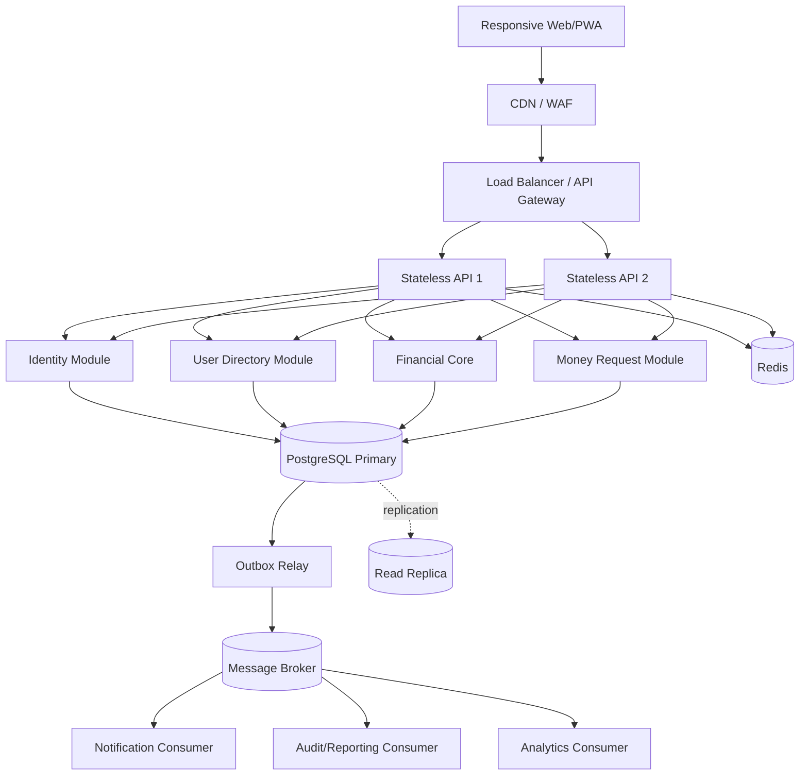

# PSTU IT Carnival 2026 — Money Movement Application

## Backend-First Architecture and Implementation Plan

**Event:** PSTU IT Carnival 2026 Hackathon  
**Date:** 29 August 2026  
**Build window:** 9:00 AM–3:00 PM  
**Product:** Closed digital money ecosystem using simulated funds  
**Growth target:** More than 10 million users within three years  
**Initial funding:** BDT 100,000 per registered user  
**Evaluation emphasis:** Backend, server, database, reliability, and distributed-systems engineering **90%**; UI/UX **10%**

> **Engineering thesis:** Keep the money-moving transaction boundary strongly consistent and small. Scale stateless services horizontally, move non-critical work asynchronously, and never trade financial correctness for superficial availability.

---

## Table of Contents

1. [Executive decision](#1-executive-decision)
2. [Challenge interpretation and success criteria](#2-challenge-interpretation-and-success-criteria)
3. [Scope and priorities](#3-scope-and-priorities)
4. [Recommended technology stack](#4-recommended-technology-stack)
5. [System architecture](#5-system-architecture)
6. [Microservice boundaries and evolution strategy](#6-microservice-boundaries-and-evolution-strategy)
7. [Backend code architecture and SOLID](#7-backend-code-architecture-and-solid)
8. [Financial domain model and invariants](#8-financial-domain-model-and-invariants)
9. [Database architecture and schema](#9-database-architecture-and-schema)
10. [ACID transfer algorithm](#10-acid-transfer-algorithm)
11. [Concurrency control](#11-concurrency-control)
12. [Idempotency and uncertain outcomes](#12-idempotency-and-uncertain-outcomes)
13. [Money-request workflow](#13-money-request-workflow)
14. [Redis design](#14-redis-design)
15. [Messaging, Outbox, and asynchronous work](#15-messaging-outbox-and-asynchronous-work)
16. [CAP theorem and consistency choices](#16-cap-theorem-and-consistency-choices)
17. [Load balancing, traffic spikes, and backpressure](#17-load-balancing-traffic-spikes-and-backpressure)
18. [Database replication, failover, backup, and recovery](#18-database-replication-failover-backup-and-recovery)
19. [Future database sharding](#19-future-database-sharding)
20. [Failure handling and graceful degradation](#20-failure-handling-and-graceful-degradation)
21. [Security architecture](#21-security-architecture)
22. [API design](#22-api-design)
23. [Observability and operations](#23-observability-and-operations)
24. [Testing and verification](#24-testing-and-verification)
25. [Deployment and delivery](#25-deployment-and-delivery)
26. [UI/UX plan — 10% focus](#26-uiux-plan--10-focus)
27. [Six-hour implementation plan](#27-six-hour-implementation-plan)
28. [Definition of Done and acceptance criteria](#28-definition-of-done-and-acceptance-criteria)
29. [Demo strategy](#29-demo-strategy)
30. [Judge-facing explanations](#30-judge-facing-explanations)
31. [Risks and deliberate trade-offs](#31-risks-and-deliberate-trade-offs)
32. [Final checklist](#32-final-checklist)

---

## 1. Executive decision

### 1.1 What to build

Build a **responsive web/PWA** with a production-oriented backend. The application should support:

- registration and login;
- automatic BDT 100,000 simulated opening balance;
- account balance and transaction history;
- send money;
- request money;
- accept, reject, or cancel a request;
- transaction receipt and status lookup;
- exactly-once business effect through idempotency;
- safe simultaneous transfers through database concurrency control;
- double-entry ledger and reconciliation;
- asynchronous notifications;
- a protected engineering dashboard for the live demo.

### 1.2 Architecture decision

Use a **microservice-ready modular architecture**, but keep the following inside one **Financial Core bounded context**:

- wallet/account;
- authoritative balance;
- transfer execution;
- limits required to approve a transfer;
- double-entry ledger;
- idempotency record;
- transactional Outbox event.

These components share one PostgreSQL transaction because splitting them would turn a safe local ACID operation into a distributed transaction.

For the six-hour competition, deploy the business modules as a **modular monolith plus an independent background worker**. The code boundaries, APIs, events, and ownership rules must make later service extraction possible. This is a more senior decision than creating many network-separated services before the team can operate them safely.

### 1.3 Recommended competition deployment

```text
Browser / PWA
      │ HTTPS
      ▼
Nginx / Load Balancer
      │
      ├──────────────► API instance 1 (stateless)
      └──────────────► API instance 2 (stateless)
                              │
              ┌───────────────┼────────────────┐
              ▼               ▼                ▼
        PostgreSQL          Redis          Outbox Worker
       source of truth   cache/limits           │
                                                ▼
                                           RabbitMQ
                                                │
                                      Notification Worker
```

### 1.4 Production evolution

```text
Clients
  │
CDN / WAF / Global DNS
  │
Regional Load Balancer
  │
API Gateway
  ├── Identity Service
  ├── User Directory Service
  ├── Financial Core Service ── PostgreSQL HA cluster
  ├── Money Request Service
  └── Operations/Admin Service
                │
       Transactional Outbox
                │
          Kafka/RabbitMQ
       ┌────────┼──────────┐
       ▼        ▼          ▼
 Notification  Audit   Analytics/Reporting
```

---

## 2. Challenge interpretation and success criteria

The challenge is not asking for a decorative wallet CRUD application. It explicitly highlights:

- users acting rapidly;
- unreliable networks;
- simultaneous activity;
- unexpected input;
- correctness, reliability, and trust;
- growth beyond 10 million users;
- a small but thoughtful working product;
- the ability to explain and defend engineering choices.

Therefore the winning story should be:

> A transfer executes once, remains correct under concurrency, survives retry and partial failure, is recorded in an immutable ledger, and can be independently reconciled afterward.

### 2.1 Scoring allocation used by this plan

| Area | Effort target | What must be visible |
|---|---:|---|
| Backend and domain correctness | 30% | ACID workflow, invariants, clean modules, error model |
| Database engineering | 25% | schema, constraints, locks, ledger, indexes, reconciliation |
| Reliability and distributed systems | 20% | idempotency, Outbox, failure behavior, retry rules, recovery |
| Scalability and operations | 15% | stateless scale-out, Redis, load balancing, pooling, metrics |
| UI/UX | 10% | clear send/request flows, status, confirmation, receipts |

This allocation preserves the stated **90:10 backend-to-UI emphasis**.

### 2.2 Measurable success criteria

- No successful transfer can leave only one account changed.
- No account balance can become negative.
- Repeating the same idempotent request produces one transfer only.
- Simultaneous requests observe serialized account updates.
- Every successful transfer produces a zero-sum ledger transaction.
- `accounts.balance_minor` equals the sum of that account’s ledger entries.
- A queue or notification outage does not roll back a committed transfer.
- A Redis outage does not corrupt or become authoritative for money.
- An unavailable authoritative database returns a safe failure, never a guessed success.
- Any API instance can process the next request.
- The team can show these claims using automated tests and a reconciliation report.

---

## 3. Scope and priorities

### 3.1 P0 — must work before submission

1. Registration/login.
2. Opening balance represented in the ledger.
3. Balance lookup.
4. Send money.
5. ACID transaction.
6. Deterministic row locking.
7. Database-level constraints.
8. Idempotency.
9. Double-entry ledger.
10. Transaction history and receipt.
11. Concurrency and duplicate-request tests.
12. Reconciliation report.

### 3.2 P1 — implement after P0 is green

- request money, accept, reject, cancel;
- asynchronous in-app notification;
- Redis-backed rate limiting;
- two stateless API replicas behind a local load balancer;
- structured logs, metrics, and health checks;
- protected engineering demo panel;
- Docker Compose startup.

### 3.3 P2 — design now, implement only if time remains

- transaction PIN;
- daily/per-transaction limits;
- refresh-token rotation;
- read replica demonstration;
- dead-letter queue viewer;
- richer audit search;
- OpenTelemetry trace viewer;
- Kubernetes manifests.

### 3.4 Explicitly out of scope

- real banks, cards, mobile financial service rails, or payment gateways;
- real-money custody and regulatory certification;
- complex KYC/AML engine;
- multi-region active-active ledger writes;
- premature physical database sharding;
- blockchain;
- dozens of microservices;
- AI features that distract from transfer correctness.

---

## 4. Recommended technology stack

The team may substitute technologies it already knows. Familiar, correctly implemented tools are better than unfamiliar fashionable tools.

| Layer | Competition recommendation | Production direction | Reason |
|---|---|---|---|
| Client | Next.js/React + TypeScript | Same PWA or native client later | Fast responsive UI and easy browser demo |
| Styling | Tailwind CSS + accessible components | Design system | Polished UI with little custom CSS |
| Backend | Spring Boot 3 + Java 21 | Same services | Strong transactions, validation, DI, mature ecosystem |
| Alternative backend | NestJS + TypeScript | Same services | Suitable if the team is much faster in TypeScript |
| Financial DB | PostgreSQL | Managed PostgreSQL HA | ACID, row locks, constraints, indexes, replication |
| Migrations | Flyway/Liquibase | Automated gated migrations | Repeatable schema history |
| Cache/limits | Redis | Redis Sentinel/Cluster | Distributed ephemeral state and rate limits |
| Broker | RabbitMQ | RabbitMQ or Kafka based on needs | RabbitMQ is easier in a short build; Kafka suits durable event streams |
| Reverse proxy | Nginx/Traefik | Cloud L7 load balancer/API gateway | Routing, TLS termination, health-aware balancing |
| Connection pool | HikariCP | PgBouncer plus application pool | Protects PostgreSQL from connection storms |
| Packaging | Docker Compose | Kubernetes/ECS/managed containers | Reproducible local demo and future orchestration |
| Tests | JUnit, Testcontainers, k6 | CI performance and chaos suites | Real PostgreSQL behavior and repeatable load tests |
| Observability | structured logs + Micrometer | OpenTelemetry, Prometheus, Grafana | Evidence for reliability and performance |

### 4.1 Money representation rule

Never use floating point for money. Store BDT in integer minor units:

```text
BDT 2,500.00 = 250000 poisha
```

Use `BIGINT amount_minor` and `CHAR(3) currency`. Convert only at the presentation boundary. Validate overflow and use checked arithmetic in application code.

---

## 5. System architecture

### 5.1 Logical component view



### 5.2 Request-path policy

| Work | Execution model | Consistency |
|---|---|---|
| Authenticate and authorize | synchronous | strong enough to protect the operation |
| Validate transfer | synchronous | current authoritative rules |
| Debit, credit, ledger, transfer, idempotency, Outbox | one DB transaction | ACID/strong |
| Return transfer result | after commit | authoritative |
| Notification | asynchronous after commit | eventual |
| Analytics/report projection | asynchronous | eventual |
| Reconciliation | scheduled/on demand | authoritative DB scan |

### 5.3 Availability zones and dependencies

Production should spread stateless instances across at least two failure domains. The financial database should have a primary and failover standby. Optional dependencies must not sit on the synchronous transfer path unless their result is required to decide whether the transfer is legal.

---

## 6. Microservice boundaries and evolution strategy

### 6.1 Target bounded contexts

| Service/bounded context | Owns | Must not own |
|---|---|---|
| API Gateway | routing, coarse auth validation, throttling, request ID | business rules or balances |
| Identity | credentials, login, refresh tokens, roles | wallet balance |
| User Directory | public profile, phone/username lookup | financial entries |
| **Financial Core** | accounts, authoritative balance, transfers, limits, ledger, idempotency, Outbox | notifications and analytics |
| Money Request | request lifecycle and notes | direct balance mutation |
| Notification | templates, delivery attempts, preferences | transfer truth |
| Audit/Reconciliation | integrity checks, operational evidence | changing posted ledger entries |
| Analytics | aggregate projections | transactional decisions |

### 6.2 The non-negotiable financial boundary

Do **not** create separate network services for Wallet, Transfer, and Ledger during this project:

```text
Unsafe split:
Transfer Service → debit Wallet Service
                 → credit Wallet Service
                 → write Ledger Service
```

A timeout after the debit but before the credit creates a distributed consistency problem requiring sagas, compensation, deduplication, ordering, and recovery. Compensation is also not equivalent to atomicity because other operations may observe the intermediate state.

Use:

```text
Financial Core Service
  └── one PostgreSQL transaction
      ├── validate idempotency
      ├── lock both accounts
      ├── validate funds/limits
      ├── update balances
      ├── append ledger entries
      ├── create transfer
      ├── write Outbox event
      └── store idempotent result
```

### 6.3 Competition versus future topology

| Concern | Six-hour build | Future production |
|---|---|---|
| Codebase | monorepo, strict modules | monorepo or polyrepo by team ownership |
| Deployment | API + worker | independently deployed bounded services |
| Data | one PostgreSQL cluster, schema ownership | database per service; Financial Core isolated |
| Calls | in-process interfaces | synchronous API only where necessary; events otherwise |
| Discovery | static Docker names | platform service discovery |
| Broker | RabbitMQ | RabbitMQ/Kafka decision from delivery and replay needs |

### 6.4 Extraction sequence

1. Extract Notification first because it is asynchronous and low risk.
2. Extract Analytics/Reporting projections.
3. Extract User Directory if its load or release cadence differs.
4. Extract Identity when security/ownership requires it.
5. Extract Money Request only with a defined recovery protocol.
6. Keep Financial Core intact unless a future design can preserve ledger atomicity.

### 6.5 Database-per-service rule

Each extracted service owns its schema/database. Other services use its API or events and never query its tables directly. Shared-database access creates hidden coupling and prevents independent releases.

---

## 7. Backend code architecture and SOLID

### 7.1 Clean/hexagonal dependency direction

```text
HTTP Controller / Message Consumer
              │
              ▼
       Application Use Case
              │
              ▼
        Domain Model/Policy
              │
       ports/interfaces
       ┌──────┴─────────┐
       ▼                ▼
PostgreSQL Adapter   Broker Adapter
```

Domain logic must not import controllers, ORM entities, Redis clients, or broker libraries.

### 7.2 Suggested backend structure

```text
backend/
├── apps/
│   ├── api/
│   └── outbox-worker/
├── modules/
│   ├── identity/
│   ├── users/
│   ├── financial-core/
│   │   ├── domain/
│   │   ├── application/
│   │   ├── adapters/http/
│   │   ├── adapters/persistence/
│   │   └── tests/
│   ├── money-request/
│   ├── notification/
│   ├── reconciliation/
│   └── audit/
├── platform/
│   ├── security/
│   ├── observability/
│   ├── database/
│   ├── messaging/
│   └── web/
├── migrations/
├── load-tests/
└── docker-compose.yml
```

### 7.3 SOLID application

| Principle | Concrete application |
|---|---|
| Single Responsibility | `TransferUseCase` moves money; `NotificationConsumer` delivers messages |
| Open/Closed | fee and limit policies implement interfaces and can be added without rewriting transfer orchestration |
| Liskov Substitution | repository/test doubles honor transaction and uniqueness contracts |
| Interface Segregation | small ports such as `AccountReader`, `LedgerWriter`, `EventPublisher` |
| Dependency Inversion | use cases depend on ports; PostgreSQL/Redis/RabbitMQ are adapters |

### 7.4 Patterns used for real reasons

- **Repository:** persistence abstraction at the application boundary.
- **Strategy:** fee, limit, or risk policies.
- **State machine:** transfer and money-request lifecycle.
- **Adapter:** notification providers and external identity providers.
- **Outbox/Inbox:** reliable event publication and consumer deduplication.
- **Circuit breaker:** optional remote providers, not the local ACID database transaction.
- **Dependency Injection:** replace infrastructure and isolate tests.

Avoid pattern-heavy code that hides the actual money rules.

### 7.5 Transaction ownership

The application use case—not an HTTP controller or repository—owns the transaction boundary. Repository calls participating in a transfer must share the same database connection and transaction.

---

## 8. Financial domain model and invariants

### 8.1 Aggregate concepts

- **User:** person allowed to authenticate.
- **Account:** financial container belonging to a user.
- **Transfer:** intent and outcome of moving value.
- **Ledger transaction:** immutable accounting event.
- **Ledger entry:** signed change for one account.
- **Money request:** request workflow, not money itself.
- **Idempotency record:** durable mapping from logical request to result.
- **Outbox event:** durable promise to publish a committed domain event.

### 8.2 Financial invariants

1. `amount_minor > 0`.
2. Currency is supported and equal on both accounts.
3. Sender and receiver are different.
4. Both accounts are active.
5. The authenticated actor owns/controls the sender account.
6. Sender balance never becomes negative.
7. One idempotency key with one request fingerprint creates at most one transfer.
8. A successful simple transfer has exactly two ledger entries.
9. Sum of signed ledger entries for every posted transfer equals zero.
10. A failed transfer changes no balance and posts no financial ledger entries.
11. Posted ledger entries are immutable.
12. Materialized account balance equals the sum of ledger entries.
13. Accepted money request can cause at most one transfer.
14. All timestamps are stored in UTC.
15. Every mutation has an actor, request ID, and auditable reason.

### 8.3 Initial BDT 100,000 without breaking accounting

Do not simply set `accounts.balance_minor = 10000000`. Post an opening ledger transaction:

```text
SYSTEM_ISSUANCE_ACCOUNT    -10,000,000 minor units
NEW_USER_ACCOUNT           +10,000,000 minor units
                            -----------------------
TOTAL                                      0
```

This keeps the closed ecosystem explainable and allows the balance to be reconstructed from the beginning.

### 8.4 Ledger versus materialized balance

- `ledger_entries` is the accounting source of truth.
- `accounts.balance_minor` is the fast materialized balance.
- Both are changed in the same transaction.
- Reconciliation independently compares them.

Computing the entire ledger sum on every home-screen read is unnecessary; trusting only a mutable balance is unauditable. Keeping both gives fast reads plus verifiability.

### 8.5 State machines

```text
Transfer:
RECEIVED → SUCCEEDED
         ↘ REJECTED

Money request:
PENDING → PROCESSING → ACCEPTED
   ├───────────────→ REJECTED
   ├───────────────→ CANCELLED
   └───────────────→ EXPIRED
```

Terminal states cannot transition again. State changes use a conditional update such as `WHERE status = 'PENDING'` so concurrent acceptance/cancellation has one winner.

---

## 9. Database architecture and schema

### 9.1 PostgreSQL is authoritative

Financial writes and correctness checks happen in PostgreSQL. Redis, browser state, queues, read replicas, and analytics projections are never authoritative for approving a transfer.

### 9.2 Core schema

```sql
users (
  id UUID PRIMARY KEY,
  phone VARCHAR(32) NOT NULL UNIQUE,
  display_name VARCHAR(120) NOT NULL,
  password_hash TEXT NOT NULL,
  status VARCHAR(20) NOT NULL,
  created_at TIMESTAMPTZ NOT NULL
)

accounts (
  id UUID PRIMARY KEY,
  user_id UUID UNIQUE REFERENCES users(id),
  currency CHAR(3) NOT NULL DEFAULT 'BDT',
  balance_minor BIGINT NOT NULL CHECK (balance_minor >= 0),
  status VARCHAR(20) NOT NULL,
  version BIGINT NOT NULL DEFAULT 0,
  created_at TIMESTAMPTZ NOT NULL,
  updated_at TIMESTAMPTZ NOT NULL
)

transfers (
  id UUID PRIMARY KEY,
  reference VARCHAR(40) NOT NULL UNIQUE,
  sender_account_id UUID NOT NULL REFERENCES accounts(id),
  receiver_account_id UUID NOT NULL REFERENCES accounts(id),
  amount_minor BIGINT NOT NULL CHECK (amount_minor > 0),
  currency CHAR(3) NOT NULL,
  status VARCHAR(20) NOT NULL,
  request_id UUID NOT NULL,
  created_at TIMESTAMPTZ NOT NULL,
  completed_at TIMESTAMPTZ,
  CHECK (sender_account_id <> receiver_account_id)
)

ledger_transactions (
  id UUID PRIMARY KEY,
  transfer_id UUID UNIQUE REFERENCES transfers(id),
  type VARCHAR(30) NOT NULL,
  posted_at TIMESTAMPTZ NOT NULL,
  description TEXT
)

ledger_entries (
  id UUID PRIMARY KEY,
  ledger_transaction_id UUID NOT NULL REFERENCES ledger_transactions(id),
  account_id UUID NOT NULL REFERENCES accounts(id),
  amount_minor BIGINT NOT NULL CHECK (amount_minor <> 0),
  currency CHAR(3) NOT NULL,
  created_at TIMESTAMPTZ NOT NULL
)

idempotency_records (
  actor_id UUID NOT NULL,
  endpoint VARCHAR(100) NOT NULL,
  idempotency_key VARCHAR(128) NOT NULL,
  request_hash CHAR(64) NOT NULL,
  status VARCHAR(20) NOT NULL,
  resource_id UUID,
  http_status INT,
  response_body JSONB,
  created_at TIMESTAMPTZ NOT NULL,
  completed_at TIMESTAMPTZ,
  PRIMARY KEY (actor_id, endpoint, idempotency_key)
)

money_requests (
  id UUID PRIMARY KEY,
  requester_account_id UUID NOT NULL REFERENCES accounts(id),
  payer_account_id UUID NOT NULL REFERENCES accounts(id),
  amount_minor BIGINT NOT NULL CHECK (amount_minor > 0),
  currency CHAR(3) NOT NULL,
  note VARCHAR(200),
  status VARCHAR(20) NOT NULL,
  transfer_id UUID UNIQUE REFERENCES transfers(id),
  expires_at TIMESTAMPTZ NOT NULL,
  created_at TIMESTAMPTZ NOT NULL,
  updated_at TIMESTAMPTZ NOT NULL,
  CHECK (requester_account_id <> payer_account_id)
)

outbox_events (
  id UUID PRIMARY KEY,
  aggregate_type VARCHAR(50) NOT NULL,
  aggregate_id UUID NOT NULL,
  event_type VARCHAR(100) NOT NULL,
  payload JSONB NOT NULL,
  occurred_at TIMESTAMPTZ NOT NULL,
  published_at TIMESTAMPTZ,
  attempt_count INT NOT NULL DEFAULT 0
)

consumer_inbox (
  consumer_name VARCHAR(100) NOT NULL,
  event_id UUID NOT NULL,
  processed_at TIMESTAMPTZ NOT NULL,
  PRIMARY KEY (consumer_name, event_id)
)

audit_logs (
  id UUID PRIMARY KEY,
  actor_id UUID,
  action VARCHAR(100) NOT NULL,
  resource_type VARCHAR(50) NOT NULL,
  resource_id UUID,
  request_id UUID NOT NULL,
  metadata JSONB,
  created_at TIMESTAMPTZ NOT NULL
)
```

### 9.3 Important indexes

```text
accounts(user_id) UNIQUE
users(phone) UNIQUE
transfers(reference) UNIQUE
transfers(sender_account_id, created_at DESC)
transfers(receiver_account_id, created_at DESC)
ledger_entries(account_id, created_at, id)
ledger_entries(ledger_transaction_id)
money_requests(payer_account_id, status, created_at DESC)
money_requests(requester_account_id, status, created_at DESC)
outbox_events(published_at, occurred_at) WHERE published_at IS NULL
```

Indexes must follow real query patterns. Inspect execution plans for history and Outbox polling; do not add indexes blindly because each one increases write cost.

### 9.4 Constraints and immutability

Protect rules twice: domain validation produces helpful errors; database constraints are the final safety net.

- Revoke `UPDATE` and `DELETE` on posted ledger tables from the application role, or use a trigger that rejects mutation.
- Allow correction only through a new reversal transaction, never by editing history.
- Enforce ledger balancing inside the posting procedure/use case and verify it continuously with reconciliation. A deferred database trigger can provide additional protection if implemented carefully.
- Use foreign keys for referential integrity.
- Use separate least-privilege roles for migrations, application runtime, read-only reporting, and backup.

### 9.5 Isolation level

Recommended competition choice:

- PostgreSQL `READ COMMITTED`;
- explicit `SELECT ... FOR UPDATE` on all accounts involved;
- deterministic lock order;
- constraints and atomic transaction.

This is understandable and adequate for the defined transfer path. `SERIALIZABLE` is a valid stronger alternative, but the application must retry serialization failures with bounded jitter. Do not claim an isolation level is sufficient without showing how conflicting rows and predicates are protected.

### 9.6 DBA operating practices

- Run schema changes through versioned migrations.
- Use `NOT NULL`, checks, unique constraints, and foreign keys.
- Set statement, lock, and idle-transaction timeouts.
- Monitor slow queries, deadlocks, connection utilization, WAL growth, replication lag, table/index bloat, and vacuum health.
- Keep transactions short; never call remote services while holding database locks.
- Use PgBouncer or a managed proxy to cap database connections.
- Test restore procedures, not only backup creation.

---

## 10. ACID transfer algorithm

### 10.1 ACID mapping

| Property | How the design provides it |
|---|---|
| Atomicity | debit, credit, transfer, ledger, idempotency, and Outbox commit or roll back together |
| Consistency | domain rules plus database constraints preserve invariants |
| Isolation | row locks and deterministic ordering prevent lost updates/double spend |
| Durability | PostgreSQL WAL/commit makes the result survive process failure; HA/backup protect infrastructure loss |

### 10.2 Detailed transaction flow

```text
1. Authenticate actor and authorize sender account.
2. Validate syntax, amount, currency, recipient, and idempotency key.
3. Begin database transaction.
4. Insert/reserve idempotency record with request hash.
5. If completed, return stored result; if same key/different hash, reject.
6. Sort sender and receiver account IDs.
7. Lock both rows in sorted order using SELECT ... FOR UPDATE.
8. Revalidate account status, ownership, currency, balance, and limits.
9. Create transfer record/reference.
10. Atomically decrement sender balance and increment receiver balance.
11. Insert ledger transaction.
12. Insert sender negative entry and receiver positive entry.
13. Assert entry sum is zero.
14. Insert TransferSucceeded Outbox event.
15. Store the final response in the idempotency record.
16. Commit.
17. Return the committed result.
18. Outbox worker publishes notifications/analytics later.
```

### 10.3 Pseudocode

```java
@Transactional
TransferResult transfer(Command c) {
    IdempotencyDecision d = idempotency.reserve(
        c.actorId(), "POST:/api/v1/transfers", c.key(), sha256(c.canonicalBody()));

    if (d.isCompleted()) return d.previousResult();
    if (d.isPayloadConflict()) throw conflict("IDEMPOTENCY_KEY_REUSED");

    List<Account> locked = accounts.lockInAscendingIdOrder(c.senderId(), c.receiverId());
    Account sender = find(locked, c.senderId());
    Account receiver = find(locked, c.receiverId());

    policy.validate(c.actorId(), sender, receiver, c.amountMinor(), c.currency());
    sender.debit(c.amountMinor());
    receiver.credit(c.amountMinor());

    Transfer t = transfers.createSucceeded(c);
    ledger.postBalanced(t,
        entry(sender.id(), -c.amountMinor()),
        entry(receiver.id(), c.amountMinor()));
    outbox.append(TransferSucceeded.from(t));

    TransferResult result = TransferResult.from(t);
    idempotency.complete(c.key(), result);
    return result;
}
```

### 10.4 Errors and rollback

Business rejections such as insufficient funds return a stable error code. Infrastructure failures roll the transaction back. Never catch an exception and return success before the commit is known to have succeeded.

---

## 11. Concurrency control

### 11.1 Lost-update example

With balance BDT 1,000, two requests for BDT 800 and BDT 700 can both read 1,000 in naive code and both approve. Application-level checks alone are unsafe.

### 11.2 Row locking

```sql
SELECT id, balance_minor, currency, status
FROM accounts
WHERE id IN (:sender_id, :receiver_id)
ORDER BY id
FOR UPDATE;
```

The second conflicting transaction waits, then sees the committed balance from the first. It cannot spend a stale value.

### 11.3 Deadlock prevention

For `Alice → Bob` and `Bob → Alice`, always lock the smaller account ID first, regardless of direction. Consistent lock order dramatically reduces deadlocks. Still detect database deadlock errors and retry the entire transaction a small bounded number of times using jitter.

### 11.4 Why not an in-memory or Redis lock

- An in-memory mutex protects only one process.
- A Redis lock adds leases, expiration, fencing, and network-partition complexity.
- The database already serializes access to the authoritative rows.

Redis locks may coordinate non-financial jobs, but financial correctness remains protected by PostgreSQL.

### 11.5 Alternative atomic debit

For a single-account debit, this pattern is useful:

```sql
UPDATE accounts
SET balance_minor = balance_minor - :amount,
    version = version + 1
WHERE id = :sender
  AND status = 'ACTIVE'
  AND balance_minor >= :amount;
```

Check that exactly one row changed. A transfer still needs coordinated credit and ledger inserts in the same transaction.

### 11.6 Concurrency acceptance test

Starting sender balance: BDT 10,000. Launch 100 simultaneous requests of BDT 200 with unique idempotency keys.

Expected:

- exactly 50 succeed;
- exactly 50 return insufficient funds;
- sender ends at zero;
- receiver gains BDT 10,000;
- no negative account;
- 50 transfers and 100 ledger entries exist;
- ledger total is zero.

---

## 12. Idempotency and uncertain outcomes

### 12.1 Contract

Every money mutation requires `Idempotency-Key`. The key is scoped by authenticated actor and endpoint. The client creates one key per user intent and reuses it for retries.

### 12.2 Durable algorithm

1. Canonicalize the request body and compute a request hash.
2. Insert `(actor, endpoint, key, hash, PROCESSING)` under a unique constraint.
3. If the key exists with another hash, return `409 IDEMPOTENCY_KEY_REUSED`.
4. If it exists as completed, replay the original status and response.
5. Execute transfer and complete the record in the same ACID transaction.
6. Concurrent duplicate requests either wait/re-read or receive a short `409/425 REQUEST_IN_PROGRESS` with safe retry guidance.

### 12.3 Why Redis alone is insufficient

Redis can reject obvious duplicates quickly, but eviction, failover, TTL expiry, or outage cannot be allowed to duplicate money. The PostgreSQL unique constraint and transaction provide the final guarantee.

### 12.4 Ambiguous commit response

The database may commit and the connection may fail before the API response arrives. The client must not invent failure or generate a new intent. It should:

1. retry with the same key; or
2. query `GET /api/v1/idempotency/{key}` / transfer status.

The server returns the stored committed result.

### 12.5 Retention

Retain financial idempotency records long enough to exceed every client/network retry window and comply with audit needs. Do not use a short cache TTL as the only protection. A future archival policy can compact old response bodies while keeping business uniqueness.

---

## 13. Money-request workflow

### 13.1 Creation

The requester identifies the payer, amount, optional note, and expiry. Server-side rules prevent self-request, invalid amount, unsupported currency, or unknown payer.

### 13.2 Acceptance under concurrency

Acceptance must be idempotent. Inside one transaction for the competition build:

1. lock the request row;
2. verify `status = PENDING`, not expired, and actor is payer;
3. change to `PROCESSING` or execute the Financial Core use case directly;
4. move payer funds to requester using the normal transfer algorithm;
5. set `ACCEPTED` and attach the unique transfer ID;
6. write Outbox events;
7. commit.

Conditional state updates make simultaneous accept, cancel, and expiry deterministic.

### 13.3 Future separated service

If Money Request becomes a separate service, it calls Financial Core with deterministic idempotency key `money-request:{requestId}:accept`. Financial Core owns the financial result. The request service uses retry plus events/status reconciliation to repair a missed response. This workflow is eventually consistent, but the money movement itself remains atomic and exactly-once in Financial Core.

---

## 14. Redis design

### 14.1 Appropriate uses

- distributed rate-limit counters;
- short-lived OTP challenges;
- revoked session/token identifiers if required;
- recipient public-profile cache;
- configuration/features with safe staleness;
- short-lived idempotency fast path backed by PostgreSQL;
- response caching for non-financial public data.

### 14.2 Inappropriate uses

- authoritative balance;
- final transfer status;
- sole idempotency store;
- only protection against double spending;
- permanent audit log.

### 14.3 Cache strategy

Use cache-aside:

```text
read cache → miss → read owner database → populate with TTL
```

Use explicit versioning/invalidation for changed user profiles. Avoid caching current balances for the hackathon. If balance caching is added later, display it as a projection and use authoritative primary reads for any decision or immediate post-transfer receipt.

### 14.4 Redis availability policy

| Redis feature | On Redis failure |
|---|---|
| profile cache | bypass and read DB with bounded protection |
| rate limiter | fail closed for login/high-risk endpoints; use conservative local emergency limits for safe reads |
| session lookup | token validation/DB fallback according to auth design |
| idempotency fast path | fall back to PostgreSQL guarantee |
| balance | unaffected because Redis is not authoritative |

Production Redis may use Sentinel/Cluster, replicas, persistence according to data criticality, timeouts, and circuit breakers. Its failure must cause controlled degradation, not incorrect money.

---

## 15. Messaging, Outbox, and asynchronous work

### 15.1 The dual-write problem

This is unsafe:

```text
commit database
publish broker message
```

The process can crash between the two steps. The transfer is real, but downstream services never hear about it.

### 15.2 Transactional Outbox

Insert the event into `outbox_events` in the same transaction as the transfer. A relay later publishes it:

```sql
SELECT *
FROM outbox_events
WHERE published_at IS NULL
ORDER BY occurred_at
FOR UPDATE SKIP LOCKED
LIMIT 100;
```

After broker confirmation, mark it published. Multiple relay instances can work safely with `SKIP LOCKED`.

### 15.3 Delivery semantics

Assume **at-least-once delivery**. “Exactly once” across a database and broker is not claimed. Each event has a globally unique `eventId`; consumers insert it into `consumer_inbox` under a unique key before applying effects. Duplicate delivery then becomes harmless.

### 15.4 Event envelope

```json
{
  "eventId": "uuid",
  "eventType": "financial.transfer.succeeded.v1",
  "aggregateId": "transfer-uuid",
  "occurredAt": "2026-08-29T05:30:00Z",
  "traceId": "trace-id",
  "schemaVersion": 1,
  "payload": {
    "transferId": "uuid",
    "amountMinor": 250000,
    "currency": "BDT"
  }
}
```

Do not put secrets, password data, or unnecessary personal information in events.

### 15.5 Retry and dead-letter queue

- exponential backoff with jitter;
- maximum attempts;
- dead-letter queue after repeated failure;
- alerts on DLQ depth and oldest Outbox age;
- operator replay after the fault is corrected;
- idempotent consumer so replay is safe.

### 15.6 Broker choice

- **RabbitMQ for the hackathon:** simple work queues, acknowledgements, routing, and quick setup.
- **Kafka later:** durable replayable streams, high event volume, many independent consumers.

Choose based on semantics and operating ability, not brand popularity.

---

## 16. CAP theorem and consistency choices

CAP applies when a network partition occurs in a distributed system. Partition tolerance is unavoidable; during a partition, a component cannot guarantee both perfect consistency and availability.

| Domain | Orientation during partition | Behavior |
|---|---|---|
| Financial writes/ledger | CP | reject or delay if authoritative state cannot be confirmed |
| Immediate transfer receipt | consistent primary read | return committed result/idempotent replay |
| Authentication/authorization | consistency and security first | fail safely when authority is unavailable |
| Notification | AP-friendly/eventual | deliver later |
| Analytics/dashboard projections | AP-friendly/eventual | may be temporarily stale and labeled |
| Search/profile cache | available with bounded staleness | fall back or display safe cached data |

Correct judge explanation:

> During a partition, we prefer temporarily refusing a transfer over accepting one against an unverified balance. Optional notifications and analytics remain available or catch up later. CAP is not one global label for the entire product; each bounded context makes an explicit trade-off.

### 16.1 ACID is not CAP

- ACID describes database transaction behavior.
- CAP describes consistency/availability trade-offs during partitions.
- Replication does not automatically make a database both perfectly consistent and always available.
- A system can use ACID locally and eventual consistency across service projections.

---

## 17. Load balancing, traffic spikes, and backpressure

### 17.1 Stateless API tier

No critical user state lives only in API process memory. Tokens, PostgreSQL, and shared ephemeral infrastructure let request 1 hit API-1 and request 2 hit API-8 safely.

### 17.2 Traffic path

```text
Internet
  │
CDN/WAF
  │
Load Balancer
  │
Gateway: auth + request size + rate limit
  │
Stateless API replicas
  │
Bounded connection pool / PgBouncer
  │
PostgreSQL primary
```

### 17.3 Load balancer behavior

- health-aware routing using readiness checks;
- least-connections or round-robin for similar instances;
- TLS termination;
- no sticky session requirement;
- connection and request timeouts;
- request ID propagation;
- graceful instance draining during deployment.

### 17.4 Autoscaling signals

- request rate;
- CPU/memory;
- p95/p99 latency;
- active requests;
- event-loop/thread-pool saturation;
- DB pool wait time and utilization;
- queue depth and consumer lag;
- Outbox oldest-event age.

### 17.5 Protect the database while scaling APIs

If each API instance opens 20 DB connections, 100 instances could request 2,000 connections and collapse the database. Use:

- small bounded per-instance pools;
- PgBouncer/managed proxy;
- global connection budget;
- autoscaling capped by downstream capacity;
- query timeouts and slow-query monitoring.

### 17.6 Rate-limit policy

Illustrative values, tuned by testing:

| Endpoint | Limit dimension | Example |
|---|---|---:|
| Login | IP + account | 5 attempts/minute |
| Transfer | user + account | 10/minute |
| Money request | user | 20/minute |
| Recipient search | user/IP | 60/minute |
| History | user | 120/minute |

Return `429` with `Retry-After`. Limits must not replace transaction authorization or fraud controls.

### 17.7 Load shedding and bulkheads

When overloaded:

1. reject expensive non-critical reports first;
2. cap queues and worker concurrency;
3. keep transfer resources separate from analytics resources;
4. return `503` plus `Retry-After` before all pools are exhausted;
5. let clients retry only idempotent requests with exponential backoff and jitter.

Controlled degradation protects core money movement from cascading failure.

---

## 18. Database replication, failover, backup, and recovery

### 18.1 Replication topology

```text
Applications → Primary PostgreSQL
                    │ WAL streaming
             ┌──────┴──────┐
             ▼             ▼
       HA standby     Read replica(s)
```

- All financial writes go to the primary.
- Immediate read-after-write receipts use primary/consistent session routing.
- Stale-tolerant history/report queries may use replicas.
- Monitor replication lag in bytes and seconds.

### 18.2 Synchronous versus asynchronous standby

- Synchronous replication can target lower data-loss risk but adds latency and may reduce write availability.
- Asynchronous replication improves latency/availability but failover may lose the newest commits.

For production money movement, decide RPO/RTO explicitly and use a synchronous HA standby where the latency budget permits. The hackathon should explain this trade-off rather than pretending replicas remove all risk.

### 18.3 Failover behavior

1. Health system detects primary loss.
2. Orchestrator promotes an eligible standby using a single-writer/fencing mechanism.
3. Connection proxy/DNS routes new traffic.
4. applications reconnect with bounded backoff;
5. ambiguous client operations retry with the same idempotency key;
6. reconciliation verifies balances and ledger after recovery.

Prevent split brain with leader election and fencing; never allow two writable primaries.

### 18.4 Backups and point-in-time recovery

- scheduled encrypted base backups;
- continuous WAL archiving for point-in-time recovery;
- retention policy and off-site/cross-account copy;
- regular restore drills into an isolated environment;
- checksums and reconciliation after restore;
- documented recovery runbook.

Suggested production objectives to validate with the business:

| Component | Illustrative RPO | Illustrative RTO |
|---|---:|---:|
| Financial DB with synchronous standby | near zero | 5–15 minutes |
| Async reporting projection | minutes | under 1 hour |
| Notification queue | no acknowledged-event loss | under 1 hour |

These are design targets, not claims until tested.

### 18.5 Database unavailable

- readiness fails so load balancer stops new traffic to unhealthy instances;
- financial writes return `503 SERVICE_TEMPORARILY_UNAVAILABLE`;
- no balance is guessed and no success is fabricated;
- safe public/read-only experiences may continue if their data is labeled and sufficiently fresh;
- clients retain their idempotency key and retry later.

---

## 19. Future database sharding

### 19.1 Do not shard on day one

First use:

- correct indexes;
- query optimization;
- partition large time-series tables;
- read replicas for safe reads;
- archiving;
- connection pooling;
- vertical scale within reason.

Physical sharding increases operational and transactional complexity and should follow measured bottlenecks.

### 19.2 Sharding roadmap

1. Separate non-financial service databases.
2. Partition audit/history by time for maintenance.
3. Route reporting to projections/data warehouse.
4. Identify actual Financial Core access patterns and hot keys.
5. Introduce a shard directory/router.
6. Use stable virtual shards to make rebalancing possible.
7. Move shards with dual-read verification and reconciliation.
8. Retain globally unique IDs and shard-aware observability.

### 19.3 The cross-shard transfer problem

Hashing solely by `user_id` spreads accounts well, but Alice and Bob may land on different shards. Debit and credit would then cross databases and cannot use one local ACID transaction.

Future options include:

- route paired/internal accounts to a common ledger partition where access patterns permit;
- use a dedicated ledger architecture with reservations and an orchestrated state machine;
- use a distributed SQL database only after validating its consistency, latency, failure, and operating trade-offs;
- maintain per-shard clearing accounts and asynchronous settlement with rigorous reconciliation.

None is free. The competition build should keep Financial Core on one relational authority and present sharding as an evidence-driven future design, not a checkbox.

### 19.4 Avoid hot shards

Sequential IDs, system accounts, celebrity merchants, or campaign recipients can create hotspots. Virtual shards, balanced keys, tenant/range analysis, and hot-account serialization must be considered before selecting a final shard key.

---

## 20. Failure handling and graceful degradation

### 20.1 Failure matrix

| Failure | Expected behavior | Recovery/control |
|---|---|---|
| client double-click | one transfer | durable idempotency key and unique constraint |
| response lost after commit | outcome reported as unknown; same-key retry returns result | status lookup/idempotent replay |
| API crashes before commit | rollback | retry with same key |
| API crashes after commit | committed money remains; Outbox remains | replay result; relay publishes later |
| Redis down | cache/limits degraded; money stays correct | DB fallback, local emergency limits, circuit breaker |
| broker down | transfer commits; Outbox backlog grows | retry relay, alert, publish after recovery |
| notification provider down | transfer still succeeds | timeout, circuit breaker, retry/DLQ |
| DB primary down | stop financial writes safely | failover, idempotent retry, reconciliation |
| read replica lag | never approve from replica | primary route for critical/read-after-write reads |
| one API instance down | traffic goes to healthy instances | load balancer health checks |
| overload | reject/throttle low-priority work | rate limit, bulkheads, backpressure, autoscale |
| poison event | consumer does not loop forever | bounded attempts and DLQ |
| deadlock/serialization error | no partial effect | retry whole transaction with jitter |

### 20.2 Timeouts and retries

- Every network call has a timeout.
- Retries are bounded and use exponential backoff plus jitter.
- Retry safe reads automatically when appropriate.
- Retry money mutations only with the same idempotency key.
- Never retry validation/auth failures.
- Use circuit breakers for remote optional dependencies.
- Do not keep database locks open while making network calls.

### 20.3 Graceful shutdown

On deployment or termination:

1. mark instance unready;
2. stop accepting new work;
3. drain in-flight HTTP requests;
4. finish or roll back DB transactions;
5. stop consuming new messages;
6. acknowledge only completed events;
7. close pools cleanly.

---

## 21. Security architecture

The money is simulated, but the engineering should model real security discipline.

### 21.1 Authentication and sessions

- hash passwords using Argon2id or appropriately costed bcrypt;
- short-lived access token plus rotated refresh token, or secure server-side session;
- store browser tokens in secure, `HttpOnly`, `SameSite` cookies where suitable;
- revoke/rotate on logout or suspicious activity;
- optional transaction PIN kept separate from login password and hashed;
- generic login errors to reduce account enumeration.

### 21.2 Authorization

- server derives actor identity from authenticated context;
- object-level authorization on every account, request, transfer, and receipt;
- role-based access for engineering/admin features;
- admin endpoints isolated, disabled in public production, and fully audited;
- never accept sender ownership, balance, fee, or transfer status from the client.

### 21.3 Input and API protection

- schema validation and allowlists;
- parameterized ORM/SQL queries;
- strict request-body limits;
- rate limits and login throttling;
- CSRF protection for cookie authentication;
- narrow CORS allowlist;
- output encoding and Content Security Policy;
- stable public errors without stack traces or SQL detail.

### 21.4 Data protection

- TLS in transit;
- encryption at rest and encrypted backups in production;
- secrets from a secret manager/environment injection, never source control;
- redact tokens, password data, and unnecessary PII from logs/events;
- separate runtime and migration DB roles;
- audit access to privileged operations.

### 21.5 Threats to demonstrate

| Threat | Control |
|---|---|
| tampered amount/balance | server validation and authoritative DB |
| replay/double click | idempotency and auth |
| IDOR/object access | ownership checks on every resource |
| brute-force login | hashing, throttling, lock/captcha policy |
| SQL injection | parameterized queries and validation |
| token theft | secure cookies, short TTL, rotation, TLS |
| privileged misuse | RBAC, least privilege, immutable audit |
| denial of service | WAF, request limits, rate limits, load shedding |

---

## 22. API design

### 22.1 Conventions

- versioned base path: `/api/v1`;
- JSON with consistent success/error envelopes;
- UUID/ULID identifiers;
- UTC ISO-8601 timestamps;
- integer minor units in machine contracts;
- `Idempotency-Key` required for financial mutations;
- `X-Request-Id` accepted/generated and echoed;
- cursor pagination for history;
- OpenAPI specification generated and checked in.

### 22.2 Endpoints

| Method | Endpoint | Purpose |
|---|---|---|
| POST | `/auth/register` | register and create funded account |
| POST | `/auth/login` | authenticate |
| POST | `/auth/refresh` | rotate/refresh token |
| POST | `/auth/logout` | revoke session |
| GET | `/users/search?q=` | recipient lookup |
| GET | `/accounts/me` | authoritative account summary |
| POST | `/transfers` | execute idempotent transfer |
| GET | `/transfers/{id}` | status/receipt |
| GET | `/transactions?cursor=` | paginated history |
| POST | `/money-requests` | create request |
| GET | `/money-requests?status=` | list incoming/outgoing requests |
| POST | `/money-requests/{id}/accept` | accept idempotently |
| POST | `/money-requests/{id}/reject` | reject pending request |
| POST | `/money-requests/{id}/cancel` | requester cancels pending request |
| GET | `/health/live` | process liveness only |
| GET | `/health/ready` | ability to receive traffic |
| GET | `/internal/metrics` | protected metrics scrape |
| POST | `/engineering/reconcile` | protected demo/admin operation |

### 22.3 Transfer request

```http
POST /api/v1/transfers
Authorization: Bearer <token>
Idempotency-Key: 3bc8899b-1229-46c4-a862-f3f2863cbe35
Content-Type: application/json

{
  "recipientId": "user-uuid",
  "amountMinor": 250000,
  "currency": "BDT",
  "note": "Lunch"
}
```

```json
{
  "success": true,
  "data": {
    "transferId": "transfer-uuid",
    "reference": "TX-20260829-000001",
    "status": "SUCCEEDED",
    "amountMinor": 250000,
    "currency": "BDT",
    "completedAt": "2026-08-29T05:30:00Z"
  },
  "meta": {
    "requestId": "request-uuid",
    "idempotentReplay": false
  }
}
```

### 22.4 Error response

```json
{
  "success": false,
  "error": {
    "code": "INSUFFICIENT_FUNDS",
    "message": "Your available balance is insufficient.",
    "retryable": false
  },
  "meta": {
    "requestId": "request-uuid"
  }
}
```

Recommended mappings:

- `400` malformed request;
- `401` unauthenticated;
- `403` unauthorized;
- `404` resource not visible/found;
- `409` state or idempotency payload conflict;
- `422` valid syntax but rejected business rule;
- `429` rate limited;
- `503` dependency unavailable/overloaded with safe retry guidance.

### 22.5 Client status rules

The UI shows success only after an authoritative success response. On timeout it shows **“Checking transaction status”**, keeps the same idempotency key, and resolves status before allowing a new intent.

---

## 23. Observability and operations

### 23.1 Structured logs

Every log is structured JSON with:

- timestamp;
- level;
- service and version;
- environment;
- request/trace ID;
- actor ID where permitted;
- transfer/resource ID;
- event name;
- stable error code;
- duration.

Never log secrets, raw passwords, tokens, or full sensitive payloads.

### 23.2 Metrics

#### API golden signals

- request rate;
- error rate by code;
- p50/p95/p99 latency;
- active requests and saturation.

#### Financial signals

- transfer attempts/successes/rejections;
- duplicate requests prevented;
- insufficient-fund rejections;
- deadlocks/serialization retries;
- ledger imbalance count;
- balance-reconciliation mismatch count;
- negative-account count, expected always zero.

#### Dependency signals

- DB query latency and pool wait;
- connection utilization;
- replication lag;
- Redis latency/errors;
- broker publish/consume failures;
- queue and DLQ depth;
- Outbox unpublished count and oldest age.

### 23.3 Distributed tracing

Propagate trace context through HTTP, Outbox event, broker, and consumer. A trace can show:

```text
gateway → transfer use case → account locks → commit
                                      └→ Outbox → broker → notification
```

### 23.4 Health probes

- **Liveness:** process/event loop is alive; do not fail because an optional dependency is down.
- **Readiness:** instance can safely accept its workload; financial API readiness reflects required DB access.
- **Startup:** migration/startup initialization is complete.

### 23.5 SLO examples

Illustrative targets for later validation:

- transfer API monthly availability: 99.95%;
- successful-transfer p95 latency: under 500 ms at design load;
- ledger reconciliation mismatch: exactly zero;
- duplicate business effect for same idempotency key: exactly zero;
- 99% of notification events delivered within 60 seconds;
- Outbox oldest unpublished event under 30 seconds normally.

### 23.6 Alerting

Page immediately on ledger mismatch, negative balance, split-brain risk, sustained transfer error spike, or database unavailability. Ticket/warn on growing Outbox lag, replica lag, cache error rate, and approaching storage/connection limits. Alerts should have owners and runbook links.

---

## 24. Testing and verification

### 24.1 Test pyramid

| Layer | Focus |
|---|---|
| Unit | domain rules, policies, state transitions, error mapping |
| Repository | SQL, constraints, locking, migrations, indexes |
| Integration | API → use case → real PostgreSQL via Testcontainers |
| Contract | OpenAPI and event schema compatibility |
| End-to-end | register → fund → send/request → receipt/history |
| Concurrency | simultaneous debit/accept and lock correctness |
| Property/invariant | conservation of money over generated transfer sequences |
| Load | throughput, latency, saturation, graceful overload |
| Failure/chaos | Redis/broker/API/DB interruptions and recovery |
| Security | authz, IDOR, injection, rate limits, secret/log checks |

Do not mock PostgreSQL for concurrency claims; use the real engine.

### 24.2 Mandatory automated cases

- valid transfer changes both balances and produces two balanced entries;
- insufficient funds changes nothing;
- same sender/receiver rejected;
- zero/negative/overflow amount rejected;
- inactive account rejected;
- unauthorized sender rejected;
- same idempotency key repeated 10 times creates one transfer;
- same key with different payload returns conflict;
- two simultaneous withdrawals cannot overspend;
- opposite-direction transfers do not corrupt balances;
- concurrent accept/cancel of a money request has one terminal winner;
- crash/exception before commit rolls back all rows;
- Outbox event exists exactly with committed transfer;
- duplicate event consumption creates one notification effect;
- reconciliation returns zero mismatches.

### 24.3 Conservation property

For closed-system user-to-user transfers:

```text
total balances before = total balances after
sum of all entries per ledger transaction = 0
```

Opening funds are separately balanced against the system issuance account.

### 24.4 Load test stages

1. Baseline smoke: 1–5 virtual users.
2. Expected load: stable representative traffic.
3. Spike: rapid increase resembling festival/campaign traffic.
4. Stress: discover saturation point.
5. Soak: expose leaks, pool starvation, and bloat.

Report test hardware, dataset, duration, request mix, concurrency, p95/p99, throughput, error rate, DB utilization, and invariant results. Never claim “10 million users supported” from user-count assumptions or a laptop test.

### 24.5 Reconciliation queries

Check at least:

```text
Per ledger transaction: SUM(amount_minor) = 0
Per account: accounts.balance_minor = SUM(ledger_entries.amount_minor)
All account balances >= 0
Every SUCCEEDED transfer has one ledger transaction
Every simple transfer has two expected entries
Every accepted money request has exactly one transfer
No duplicate business reference/idempotency mapping
```

### 24.6 Evidence artifact

Save test output and a short benchmark report showing configuration and results. The engineering dashboard may visualize the same facts, but automated tests remain the proof.

---

## 25. Deployment and delivery

### 25.1 Local competition environment

Docker Compose services:

```text
frontend
nginx
api-1
api-2
outbox-worker
notification-worker
postgres
redis
rabbitmq
```

Use one setup command, migrations on startup through a controlled job, deterministic seed users, and health checks. Pre-pull images and keep a recorded fallback demo because competition connectivity may be unreliable.

### 25.2 CI pipeline

```text
format/lint
  → compile
  → unit tests
  → migration validation
  → integration/concurrency tests
  → dependency/secret scan
  → build immutable image
  → generate SBOM
  → deploy staging
  → smoke tests
```

### 25.3 Production deployment

- immutable container images tagged by commit;
- at least two API replicas across failure domains;
- rolling or canary deployment;
- readiness and graceful drain;
- horizontal autoscaling with safe maximums;
- managed PostgreSQL HA and Redis where possible;
- infrastructure as code;
- separate environments/accounts and secrets;
- rollback based on image version, not manual server repair.

### 25.4 Safe database migrations

Use expand-and-contract:

1. add backward-compatible nullable/new structure;
2. deploy code that can handle old and new;
3. backfill in small resumable batches;
4. switch reads/writes;
5. validate;
6. remove old structure in a later release.

Never run a risky blocking migration immediately before the demo.

---

## 26. UI/UX plan — 10% focus

UI is deliberately small, clean, and confidence-building. It must expose backend trustworthiness without consuming the project.

### 26.1 Screens

1. Register/login.
2. Home: balance, Send, Request, recent activity.
3. Recipient search and confirmation.
4. Amount/note entry.
5. Review transfer: recipient identity, amount, fee, final total.
6. Processing/unknown/success/failure state.
7. Receipt with immutable reference and timestamp.
8. Money requests inbox/outbox.
9. Transaction history and details.
10. Protected engineering dashboard for judges.

### 26.2 Five-state transaction UX

- **Ready:** submit enabled after valid input.
- **Submitting:** button disabled; same key retained.
- **Checking status:** timeout/unknown result; no false failure or second intent.
- **Succeeded:** receipt and updated authoritative balance.
- **Rejected/failed:** specific safe message and valid next action.

### 26.3 Safety details

- show recipient name/phone confirmation before send;
- show BDT formatting consistently;
- distinguish sent and received with text/icons, not color alone;
- never optimistically display “Success” before server commit;
- block accidental double submit in UI while backend idempotency remains final protection;
- provide retry that reuses the idempotency key;
- accessible labels, keyboard navigation, focus states, contrast, and error summaries;
- mobile-first layout, responsive desktop engineering view.

### 26.4 Engineering dashboard

Display read-only results such as:

```text
Requests sent                    100
Unique transfer intents          50
Duplicate requests prevented     50
Successful transfers             50
Negative accounts                 0
Unbalanced ledger transactions    0
Balance mismatches                 0
Total money before = total money after
```

The dashboard must call protected backend endpoints and show real test/reconciliation output, not hardcoded numbers. Disable destructive load-test controls outside demo/staging.

---

## 27. Six-hour implementation plan

### 27.1 Before the event

If rules permit preparation, have ready:

- repository and module skeleton;
- Docker Compose infrastructure;
- lint/test/CI setup;
- design tokens and basic UI shell;
- architecture document and diagrams;
- dependency images cached locally;
- seed/test scripts that contain no completed challenge logic if prohibited.

Follow event rules exactly.


---

## 28. Definition of Done and acceptance criteria

A feature is done only when:

- its invariants are documented;
- validation and authorization exist;
- DB constraints support critical rules;
- success and failure paths are tested;
- logs/metrics identify failures;
- API contract is documented;
- migration and rollback compatibility are understood;
- no secrets or sensitive data are logged;
- the UI handles loading, error, unknown, empty, and success states;
- the feature works behind either stateless API instance.

### 28.1 P0 release gate

```text
[ ] Clean environment starts successfully
[ ] Migrations apply from an empty database
[ ] User receives BDT 100,000 through balanced opening entries
[ ] Normal transfer succeeds
[ ] Insufficient transfer changes nothing
[ ] Same key repeated creates one transfer
[ ] Concurrent debits cannot overspend
[ ] Ledger sum per transaction is zero
[ ] Materialized balances reconcile with ledger
[ ] API restart does not lose committed transfer result
[ ] Sensitive data absent from logs
[ ] Demo can be repeated from deterministic seed/reset procedure
```

---

## 29. Demo strategy

### 29.1 Six-minute judge sequence

**0:00–0:40 — Problem and decision**  
“We optimized for reliable money movement. The Financial Core keeps debit, credit, ledger, idempotency, and event creation in one ACID transaction.”

**0:40–1:30 — Normal send**  
Show Alice sending BDT 2,500 to Bob. Show both balances, receipt reference, and two ledger entries summing to zero.

**1:30–2:15 — Request money**  
Bob requests BDT 1,200. Alice accepts. Refresh from another browser session and show one attached transfer.

**2:15–3:00 — Double-click/network retry**  
Send the same intent 10 times with one idempotency key. Show 10 requests, one transfer, nine safe replays/prevented duplicates.

**3:00–4:00 — Concurrency proof**  
Run simultaneous withdrawals whose total demand exceeds the balance. Show successful/rejected count, no negative balance, and conserved total money.

**4:00–4:40 — Reconciliation**  
Run the real reconciliation endpoint. Show zero unbalanced ledger transactions and zero materialized-balance mismatches.

**4:40–5:20 — Failure tolerance**  
Stop notification/broker or show it unavailable. Complete a transfer, show Outbox backlog, restore worker, and show later delivery. Do not risk stopping the primary database during the live demo unless failover is fully rehearsed.

**5:20–6:00 — Scale and trade-offs**  
Show two stateless APIs behind the load balancer, Redis usage, connection limits, replica/sharding roadmap, and why the Financial Core was not fragmented.

### 29.2 Demo safeguards

- deterministic seed accounts and known balances;
- one-command startup and health overview;
- pre-warmed build and cached dependencies;
- automated reset only for demo environment;
- screenshots/short recording as fallback;
- architecture diagram available offline;
- no last-minute infrastructure experiment;
- exact test command/results ready for questions.

### 29.3 Most persuasive evidence

1. real concurrent test output;
2. idempotency replay with same transfer ID;
3. zero-sum ledger entries;
4. reconciliation report;
5. Outbox recovering after an optional-service outage;
6. request distribution across two API instances.

---

## 30. Judge-facing explanations

### 30.1 One-minute architecture answer

> Our financial core uses PostgreSQL ACID transactions because correctness is the first requirement for money movement. A transfer locks both accounts in deterministic order, verifies the authoritative balance, updates both balances, appends balanced double-entry ledger records, stores its idempotent result, and writes an Outbox event in one commit. The stateless API tier can scale horizontally behind a load balancer. Redis handles rate limiting and safe caches but never owns money. Notifications and analytics run asynchronously through an at-least-once broker with idempotent consumers. We use replicas for appropriate reads and reserve sharding for measured future need because cross-shard transfers require a different consistency design.

### 30.2 “Why not full microservices now?”

> Microservices are an organizational and operational tool, not an automatic scalability feature. We defined bounded contexts and independent ownership, but kept balance, transfer, and ledger together because they share one financial invariant and transaction boundary. Splitting them would introduce distributed transactions and more failure modes during a six-hour build. Low-risk asynchronous capabilities can be extracted first.

### 30.3 “How do you stop double spending?”

> We lock the authoritative account rows inside the transaction, always in deterministic ID order. A conflicting request waits and then sees the new committed balance. A database non-negative constraint is the final safety net. We prove this with a real PostgreSQL concurrency test.

### 30.4 “What happens if the user taps Send ten times?”

> All retries for one intent carry the same idempotency key. PostgreSQL uniquely scopes the key to the actor and endpoint and stores the request hash plus original response. Therefore ten requests can return the same result but create only one financial transfer. Reusing the key with a different payload is rejected.

### 30.5 “What if the server crashes after the transfer?”

> If the transaction did not commit, PostgreSQL rolls it back. If it committed but the response was lost, the client retries with the same key and receives the stored result. Because the Outbox event committed with the transfer, notifications can resume after recovery without changing the money outcome.

### 30.6 “What if Redis fails?”

> Redis is not the source of truth. Cache performance and distributed throttling may degrade, but PostgreSQL still protects balances, concurrency, and idempotency. We use controlled fallbacks and conservative limits for sensitive endpoints.

### 30.7 “What if the database fails?”

> We do not guess a balance or claim success. The service fails readiness and returns a safe temporary-unavailable response while the HA system promotes a fenced standby. Clients retry the same idempotency key, and reconciliation runs after recovery. Backups plus WAL archiving support point-in-time restore.

### 30.8 “How does it handle an Eid/festival traffic spike?”

> Stateless APIs scale horizontally behind a load balancer. Redis-backed rate limits, bounded queues, bulkheads, and load shedding stop overload from cascading. PgBouncer and connection budgets protect PostgreSQL while API replicas scale. Non-critical work moves through the broker, and autoscaling watches latency, saturation, queue lag, and DB pool utilization—not CPU alone.

### 30.9 “How do you apply CAP?”

> During a network partition the financial core chooses consistency over accepting an unverifiable transfer. Notifications and analytics tolerate eventual consistency and catch up later. We make the trade-off per bounded context rather than labeling the whole application CP or AP.

### 30.10 “Can this prove no money was created or destroyed?”

> Each posted transfer has signed ledger entries whose sum is zero, and every account’s materialized balance is compared with its ledger sum. Opening funds are balanced against a system issuance account. Our reconciliation endpoint reports unbalanced transactions, balance mismatches, and negative accounts; all must be zero.

---

## 31. Risks and deliberate trade-offs

| Risk/trade-off | Decision | Reason |
|---|---|---|
| many microservices look scalable | deploy few components, preserve bounded modules | reduces distributed failure while retaining evolution path |
| one financial database is a scale bottleneck | optimize/replicate first; shard after evidence | local ACID is valuable and cross-shard transfers are hard |
| row locks reduce same-account parallelism | accept serialization per hot account | one balance cannot safely be spent concurrently without coordination |
| primary reads cost capacity | use them only for financial/read-after-write truth | prevents replica-lag errors |
| Outbox delivers at least once | idempotent Inbox consumers | realistic and recoverable delivery model |
| Redis failure reduces performance | database remains authoritative | correctness survives cache failure |
| synchronous replication can reduce availability | choose from explicit RPO/latency goals | durability/availability trade-off is visible |
| small UI may look less feature-rich | polish essential flows and proof dashboard | aligns with 90% backend scoring |
| simulated funds simplify compliance | still demonstrate security and audit patterns | builds credible engineering without pretending to be a real bank |

---

## 32. Final checklist

### Product

- [ ] Responsive web/PWA works on desktop and phone.
- [ ] Registration creates an account and balanced BDT 100,000 opening entry.
- [ ] Send money works.
- [ ] Request, accept, reject, and cancel work.
- [ ] History, status, and receipt are clear.

### Financial correctness

- [ ] Integer minor units; no floating point.
- [ ] One ACID boundary for debit, credit, ledger, idempotency, and Outbox.
- [ ] Deterministic row locking.
- [ ] Non-negative balance constraint.
- [ ] Double-entry ledger is immutable.
- [ ] Idempotency key is durable and payload-bound.
- [ ] Reconciliation reports zero mismatches.

### Architecture and code

- [ ] Financial Core boundary is intact.
- [ ] Modules have clear ownership and dependency direction.
- [ ] SOLID and selected patterns solve visible problems.
- [ ] API servers are stateless.
- [ ] OpenAPI and event versioning are documented.
- [ ] Remote calls do not occur inside financial DB locks.

### Reliability and scale

- [ ] Redis is non-authoritative and has failure behavior.
- [ ] Outbox relay and idempotent consumer work.
- [ ] Rate limits, timeouts, retries, and backpressure are configured.
- [ ] Two API instances can sit behind the load balancer.
- [ ] DB pool has a strict connection budget.
- [ ] Replication/failover and sharding roadmap are explainable.
- [ ] Backup and restore strategy is documented.

### Security

- [ ] Passwords are strongly hashed.
- [ ] Authentication and object-level authorization are tested.
- [ ] Inputs are validated and SQL is parameterized.
- [ ] Secrets are outside source code.
- [ ] Sensitive values are absent from logs/events.
- [ ] Admin/demo operations are protected and non-production by default.

### Tests and operations

- [ ] Unit, integration, concurrency, and end-to-end tests pass.
- [ ] Duplicate-request test proves one transfer.
- [ ] Overdraft race test proves no negative balance.
- [ ] Load report includes environment and p95/p99 results.
- [ ] Logs, metrics, health checks, and request IDs work.
- [ ] Queue/notification failure recovery is demonstrated.
- [ ] Clean startup and deterministic demo reset are rehearsed.

### Presentation

- [ ] Six-minute story is rehearsed.
- [ ] Architecture and transfer sequence diagrams are ready offline.
- [ ] Real reconciliation output is visible.
- [ ] Each team member can explain their owned subsystem.
- [ ] Trade-offs are stated honestly; future designs are not claimed as implemented.

---

## Closing recommendation

The strongest submission is not the one with the most services or screens. It is the one that can prove:

```text
Exactly one business effect        → Idempotency
Correct result under concurrency   → ACID + deterministic row locks
No money created or destroyed      → Double-entry ledger
Provable integrity afterward       → Reconciliation
Survival of optional failures      → Outbox + asynchronous consumers
Safe horizontal growth             → Stateless APIs + load balancing
Protected downstream capacity      → rate limits + backpressure + pooling
Credible long-term evolution       → bounded contexts + replication + careful sharding
```

Build the financial core first, test it against races and retries, and then use the UI to make that engineering visible to the judges.

